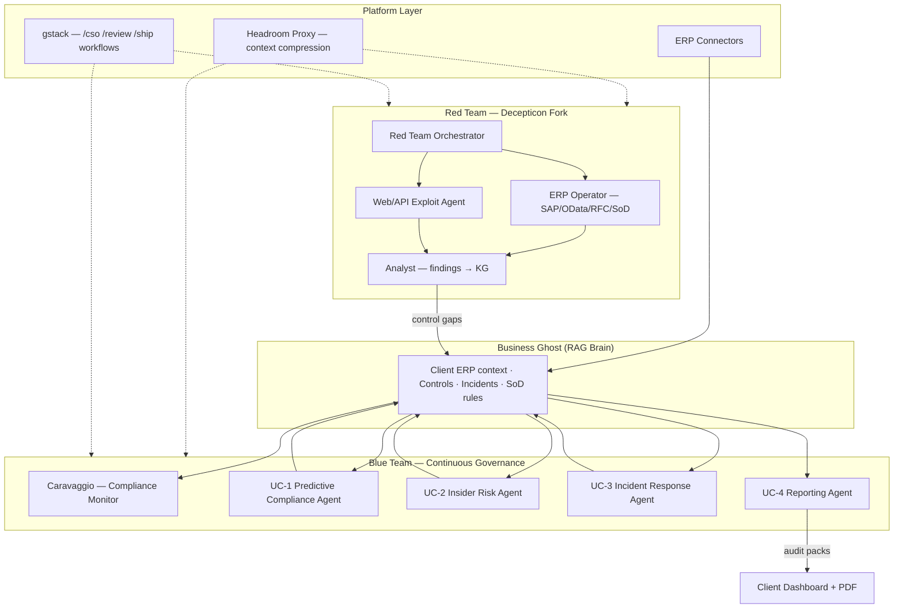
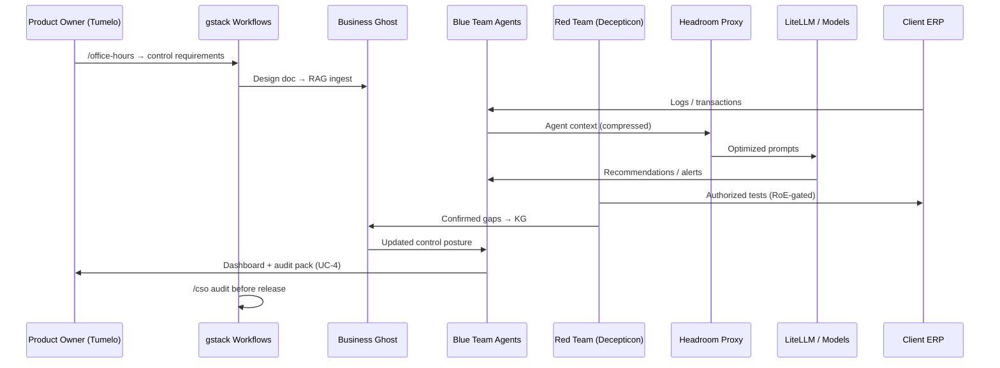

# ERP AI Security Platform — Build Plan, Red Team Agent & Cost Model

**Document status:** Draft v0.1  
**Date:** 3 July 2026  
**Related:** [`ai-compliance-erp-prd.md`](./ai-compliance-erp-prd.md)  
**Sources reviewed:**
- [PurpleAILAB/Decepticon](https://github.com/PurpleAILAB/Decepticon) — autonomous red-team agent platform
- [headroomlabs-ai/headroom](https://github.com/headroomlabs-ai/headroom) — LLM context compression & agent ops layer
- [garrytan/gstack](https://github.com/garrytan/gstack) — agent engineering workflow & security audit skills
- Studex NestVM / Super Agents stack (Caravaggio = compliance/risk agent)

> **Note:** The Google share link (`https://share.google/vsND68MfoFUq0EpxL`) could not be retrieved (404/timeout). If it contains Tumelo’s PwC proposal deck or scope doc, re-share and this plan can be reconciled against it.

---

## 1. Executive Summary

This plan describes how to build the four PRD use cases as an **agentic ERP governance platform** on Studex NestVM, with **Decepticon** adapted as the **Red Team Agent** (continuous authorized control validation), **Headroom** as the context/compute cost layer, and **gstack** as the engineering & security-audit workflow factory.

| Track | What it delivers | Indicative build cost (USD) |
|-------|------------------|----------------------------|
| **Platform foundation** | NestVM, business ghost, ERP connectors, agent orchestration | $95,000 – $145,000 |
| **UC-1** Predictive compliance | Control scoring, framework mapping, proactive remediation | $185,000 – $285,000 |
| **UC-2** Insider risk & anomaly | Behaviour baselines, SoD, real-time alerts | $225,000 – $355,000 |
| **UC-3** Automated incident response | Detection, playbooks, evidence preservation | $205,000 – $325,000 |
| **UC-4** Compliance reporting | Dashboards, audit packs, ISO/SOX/POPIA evidence | $155,000 – $245,000 |
| **Red Team Agent** (Decepticon) | Authorized ERP attack simulation → control gap feed | $130,000 – $210,000 |
| **Phase 0** Discovery & legal | PwC boundary, pilot client, RoE templates | $28,000 – $42,000 |
| **TOTAL (full platform)** | All four UCs + red team + foundation | **$1,023,000 – $1,607,000** |
| **MVP path** (recommended) | UC-4 + UC-2 + Red Team lite + foundation | **$380,000 – $580,000** |

**Per-client run cost (steady state):** $18,000 – $42,000/month (infra + LLM + support)  
**Suggested client pricing:** $45,000 – $120,000/month (enterprise regulated verticals)

---

## 2. Agent Architecture — “Governance Cell”

The platform runs as a **Governance Cell** inside each client NestVM: one central brain, six specialist agents, one red team operator.



### Agent roster

| Agent | Source | Role in platform |
|-------|--------|------------------|
| **Business Ghost** | NestVM / Naledi Brain pattern | Central RAG; stores ERP landscape, control mappings, daily ops logs |
| **Caravaggio** | Existing NestVM agent | Risk assessment & compliance monitoring orchestrator |
| **UC-1 Agent** | New build | Predictive control scoring vs ISO 27001 / SOX / POPIA |
| **UC-2 Agent** | New build | User behaviour baselines, SoD, fraud patterns |
| **UC-3 Agent** | New build | Incident classification, playbooks, evidence chain |
| **UC-4 Agent** | New build | Daily evidence extraction, dashboards, audit PDFs |
| **Red Team Orchestrator** | Decepticon `decepticon` agent | Plans & delegates authorized ERP security tests |
| **ERP Operator** | Decepticon extension (new) | SAP OData/RFC, Oracle EBS, Dynamics OData, auth-object/SoD testing |
| **Analyst** | Decepticon `analyst` agent | Ingests findings into Neo4j KG → feeds UC-1/UC-2 |

---

## 3. Red Team Agent — Decepticon Adaptation

### 3.1 Why Decepticon fits

Decepticon is an **autonomous red-team platform** (not a scanner wrapper) with:

- **Engagement discipline** — Soundwave planner → RoE, scope, deconfliction, OPPLAN
- **16+ specialist agents** orchestrated via `task()` delegation
- **270+ offensive skills** with MITRE mapping
- **Kali sandbox** — isolated execution with nftables egress control
- **Neo4j knowledge graph** — attack paths, credentials, findings
- **RoE guardrail middleware** — command parse, audit log, refuse/warn/enforce modes
- **HITL gates** for destructive operations

The PRD originally listed pen testing as out of scope; reframing it as **continuous authorized control validation (purple team)** makes it a first-class product differentiator: the Red Team Agent *proves* what UC-1 and UC-2 *predict*.

### 3.2 Mapping Decepticon → PRD use cases

| PRD use case | Red Team Agent contribution |
|--------------|----------------------------|
| **UC-1 Predictive compliance** | Simulates control bypass paths; validates whether predicted failures are exploitable; feeds KG with confirmed vs theoretical gaps |
| **UC-2 Insider risk** | Tests toxic access combinations, approval-chain bypass, ghost-vendor creation paths in sandbox/lab ERP |
| **UC-3 Incident response** | Generates realistic incident scenarios; validates playbooks fire correctly; measures MTTR in drill mode |
| **UC-4 Compliance reporting** | Produces red-team evidence packs alongside blue-team control evidence for auditor dual perspective |

### 3.3 ERP-specific extensions (build work)

Decepticon has **no native SAP/Oracle/Dynamics module**. Adapt via plugin pattern:

```
packages/erp-governance/
├── agents/
│   └── erp_operator.py          # SUBAGENT_SPEC factory (mirrors recon.py)
├── tools/
│   ├── sap_odata_probe.py       # OData metadata, service enumeration
│   ├── sap_auth_checker.py      # Auth object / T-code testing
│   ├── sod_matrix_validator.py  # Toxic combination detection
│   └── idoc_rfc_wrapper.py      # IDoc/RFC abuse (lab-only, RoE-gated)
├── skills/
│   └── standard/erp/
│       ├── sap-odata-enumeration/SKILL.md
│       ├── sap-sod-bypass/SKILL.md
│       ├── oracle-ebs-servlet/SKILL.md
│       └── dynamics-odata-privesc/SKILL.md
└── pyproject.toml               # entry-points: decepticon.subagents, decepticon.tools
```

**Reuse from Decepticon without modification:**

| ERP attack surface | Existing Decepticon agent/skill |
|--------------------|--------------------------------|
| Fiori / web portals | Recon + Exploit + `browser_action` + JWT/OAuth tools |
| OData/REST APIs | `http_request`, business-logic, IDOR, BFLA skills |
| LDAP/SSO | AD Operator, Kerberos tools |
| Cloud ERP (S/4HANA Cloud, D365) | Cloud Hunter agent |
| Phishing initial access | Phisher agent (with lure deconfliction) |

### 3.4 Safety controls for production ERP

| Control | Implementation |
|---------|----------------|
| **Scope lock** | RoE `machine_enforcement: enforce` + CIDR allowlist per engagement |
| **Environment separation** | Red team runs against DEV/QAS only by default; PRD requires explicit RoE for prod-adjacent |
| **HITL** | Role assignment, mass posting, transport import → human approval |
| **Read-only first** | ICS-operator pattern: enumerate before any write |
| **Audit trail** | All commands logged via RoE middleware; findings → Neo4j → immutable evidence store |
| **Deconfliction** | Soundwave engagement bundle before any test |

### 3.5 Red Team Agent operating modes

| Mode | When | Output |
|------|------|--------|
| **Drill** | Scheduled (monthly/quarterly) | Simulated attack report + playbook validation |
| **Continuous** | On control change (new role, new T-code) | Auto-scoped micro-engagement |
| **Audit support** | Pre-audit window | Evidence pack: “we tested X controls; Y failed” |
| **Purple sync** | After UC-2 alert | Confirm whether anomaly is exploitable |

---

## 4. Headroom — Context & Cost Layer

Headroom is **not** a compliance engine. It sits between agents and LLMs to cut token burn 60–95% on tool-heavy workloads.

### 4.1 Where Headroom applies

| Workload | Headroom compressor | Savings driver |
|----------|---------------------|----------------|
| ERP audit log ingestion | SmartCrusher | Keeps errors/anomalies, drops noise |
| Daily transaction dumps | LogCompressor | Preserves violations, compresses routine |
| Agent handoffs (UC-2 → UC-3) | SharedContext | Compressed inter-agent payloads |
| Cross-session client memory | Proxy `--memory` | Tenant control exceptions, false-positive rules |
| Red team tool output | SmartCrusher + CCR | Agent retrieves full output only when needed |
| LLM routing | LiteLLM callback integration | Centralized cost metrics |

### 4.2 Deployment

```bash
# Per client NestVM
headroom proxy --port 8787 --memory
# Route all agent LLM calls through proxy
export ANTHROPIC_BASE_URL=http://localhost:8787
```

**Integration points:**
- Decepticon already uses LiteLLM → add Headroom as LiteLLM callback or upstream proxy
- LangChain integration for UC-1/UC-2/UC-3/UC-4 agents
- Prometheus metrics for client billing and SLA dashboards

### 4.3 Cost impact

Without Headroom, ERP governance agents processing 500K–2M tokens/day per client could cost **$800–$4,000/month** in LLM fees alone. With Headroom (conservative 70% reduction on tool context): **$240–$1,200/month** — saving **$560–$2,800/month per client**.

Headroom OSS: **$0 license**. Optional Headroom Teams: budget separately if SSO/org dashboard needed.

---

## 5. gstack — Engineering & Security Workflow Factory

gstack provides **Markdown-first agent workflows** for building and auditing the platform itself.

### 5.1 Build-phase workflow mapping

| Phase | gstack skill | Application |
|-------|--------------|-------------|
| **Think** | `/office-hours` | Control design sessions with Tumelo’s risk assurance domain input |
| **Plan** | `/plan-ceo-review`, `/plan-eng-review`, `/autoplan` | PRD → eng specs → test plans per UC |
| **Build** | `/freeze`, `/guard` | Constrain agent edits to connector/skill directories |
| **Review** | `/review` + security + red-team specialists | Pre-merge review of ERP connectors & agent prompts |
| **Security audit** | `/cso --comprehensive` | Platform security before client onboarding |
| **Test** | `/qa`, `/browse` | ERP UI regression on Fiori/Dynamics portals |
| **Ship** | `/ship`, `/document-release` | Release audit packs, Diataxis doc coverage |
| **Reflect** | `/retro`, `/learn` | Tenant false-positive rules → learnings.jsonl |

### 5.2 Custom skills to create (gstack pattern)

```
~/.claude/skills/erp-governance/
├── erp-control-map/SKILL.md       # Map ERP activity → ISO/SOX/POPIA control ID
├── erp-sod-review/SKILL.md        # SoD matrix validation workflow
├── erp-audit-pack/SKILL.md        # Generate auditor evidence bundle
├── erp-red-team-roE/SKILL.md      # RoE template generator for Decepticon engagements
└── erp-incident-playbook/SKILL.md # UC-3 playbook authoring
```

### 5.3 Reuse from gstack security stack

| gstack component | Platform use |
|------------------|--------------|
| `/cso` audit phases | Adapt Phase 2 (secrets), 6 (webhooks), 7 (LLM security), 10 (STRIDE) for ERP |
| `lib/redact-patterns.ts` | Extend with payroll/tax/employee ID patterns for POPIA |
| `/review/specialists/red-team.md` | Adversarial review of agent prompts before client deploy |
| Browser security stack | Safe ERP UI testing via `/browse` + CDP allowlist |
| GBrain trust triad | Consultant access: read-only on compliance corpus |

gstack OSS: **$0 license**.

---

## 6. Full Build Plan — Phased Delivery

### Phase 0 — Discovery & Foundation (Weeks 1–4)

**Goal:** Legal clarity, pilot client, architecture frozen.

| Workstream | Deliverables | Owner |
|------------|--------------|-------|
| Legal / PwC boundary | Employment conflict memo; product entity structure | Tumelo + legal |
| Pilot client | One ERP (recommend SAP or Dynamics based on client density) | Tumelo |
| NestVM provisioning | Dedicated Governance Cell VM per pilot | Studex platform |
| Decepticon fork | `erp-governance` plugin scaffold; RoE templates for ERP | Engineering |
| Headroom deploy | Proxy + LiteLLM integration on NestVM | Engineering |
| gstack bootstrap | Team init; custom ERP skills scaffold | Engineering |
| Intake | Tumelo proposal materials reconciled with PRD | Tumelo |

**Exit criteria:** Signed pilot SOW, RoE template, ERP connector POC (read-only logs).

---

### Phase 1 — MVP (Weeks 5–16) — $380K–$580K

**Goal:** Sellable minimum — reporting + anomaly detection + red team lite.

| Sprint | Weeks | Deliverables |
|--------|-------|--------------|
| **S1** | 5–7 | ERP log ingestion (1 ERP); Business Ghost schema; Headroom wired |
| **S2** | 8–10 | **UC-4**: ISO 27001 dashboard subset; daily evidence extract; PDF report |
| **S3** | 11–13 | **UC-2**: Access/approval anomaly rules; SoD matrix v1; email alerts |
| **S4** | 14–16 | **Red Team lite**: ERP Operator read-only recon; 5 SAP/Dynamics skills; findings → KG → UC-2 feed; pilot UAT |

**MVP agent stack:** Caravaggio + UC-4 + UC-2 + Red Team Orchestrator + ERP Operator (read-only)

**gstack gates:** `/cso --diff` before pilot; `/ship` for MVP release.

---

### Phase 2 — Operational Intelligence (Weeks 17–28) — +$390K–$610K

| Sprint | Weeks | Deliverables |
|--------|-------|--------------|
| **S5** | 17–19 | **UC-1**: Control effectiveness scoring; trend degradation; remediation workflow |
| **S6** | 20–22 | **UC-3**: Incident types; detection rules; ticket creation; evidence timeline |
| **S7** | 23–25 | **Red Team full**: Write-scoped tests in lab; HITL; purple-team sync with UC-3 playbooks |
| **S8** | 26–28 | SOX + POPIA framework packs; SIEM webhook; case management (UC-2 FR-2.5) |

---

### Phase 3 — Scale (Weeks 29–40) — +$253K–$417K

| Sprint | Weeks | Deliverables |
|--------|-------|--------------|
| **S9** | 29–32 | Multi-ERP connector library (SAP + Oracle + Dynamics) |
| **S10** | 33–36 | Fraud pattern library (ghost vendor, fictitious employee) |
| **S11** | 37–40 | Partner auditor portal; Global Markets GTM pack; second client onboarding ≤ 4 weeks |

---

## 7. Cost Breakdown — All Four Use Cases + Red Team

### 7.1 One-time build costs (USD)

Assumes blended rate **$120–$175/hr** (SA-based team + specialist contractors). Ranges reflect scope uncertainty.

| Component | Low | High | Notes |
|-----------|-----|------|-------|
| **Platform foundation** | $95,000 | $145,000 | NestVM integration, Business Ghost schema, orchestration, Headroom, gstack CI |
| **UC-1 Predictive compliance** | $185,000 | $285,000 | Framework mapper, scoring engine, remediation workflow, ISO 27001 pack |
| **UC-2 Insider risk & anomaly** | $225,000 | $355,000 | Baselines, SoD engine, real-time alerts, case management, fraud patterns |
| **UC-3 Incident response** | $205,000 | $325,000 | Detection, playbooks, SIEM integration, evidence chain, escalation rules |
| **UC-4 Compliance reporting** | $155,000 | $245,000 | ETL, dashboards, PDF/audit packs, control history |
| **Red Team Agent (Decepticon)** | $130,000 | $210,000 | ERP Operator, 15–20 skills, RoE templates, KG integration, sandbox hardening |
| **Phase 0 Discovery** | $28,000 | $42,000 | Legal, pilot setup, architecture |
| **TOTAL** | **$1,023,000** | **$1,607,000** | Full platform |

### 7.2 MVP-only build (USD)

| Component | Low | High |
|-----------|-----|------|
| Platform foundation | $95,000 | $145,000 |
| UC-4 (subset) | $95,000 | $145,000 |
| UC-2 (basic) | $110,000 | $170,000 |
| Red Team lite | $55,000 | $85,000 |
| Phase 0 | $28,000 | $42,000 |
| **MVP TOTAL** | **$383,000** | **$587,000** |

### 7.3 Per-client monthly run costs (USD)

| Line item | Low | High |
|-----------|-----|------|
| NestVM compute (dedicated) | $800 | $2,500 |
| Decepticon sandbox + Neo4j + LiteLLM | $600 | $1,800 |
| LLM inference (with Headroom) | $240 | $1,200 |
| LLM inference (without Headroom) | $800 | $4,000 |
| ERP connector maintenance | $200 | $600 |
| Storage & backup (evidence, logs) | $150 | $500 |
| Monitoring & support (0.25 FTE) | $2,500 | $6,000 |
| **Total run cost / client / month** | **$4,490** | **$12,600** |
| **With premium support (0.5 FTE)** | **$8,000** | **$18,000** |

*At scale (10+ clients), infra per client drops ~30–40% through shared LiteLLM/Headroom proxy clusters.*

### 7.4 Suggested client pricing (USD/month)

| Tier | Includes | Price |
|------|----------|-------|
| **Essentials** | UC-4 + UC-2 basic | $45,000 – $65,000 |
| **Professional** | All 4 UCs | $75,000 – $95,000 |
| **Enterprise + Red Team** | All UCs + quarterly red team drills | $95,000 – $120,000 |

**Gross margin target:** 55–70% at Professional tier once platform amortized across 3+ clients.

### 7.5 Cost summary by PRD use case (build + year-1 run for 1 pilot client)

| Use case | Build (full) | Year-1 run (1 client, allocated) |
|----------|--------------|-----------------------------------|
| UC-1 Predictive compliance | $185K – $285K | $18K – $36K |
| UC-2 Insider risk | $225K – $355K | $24K – $48K |
| UC-3 Incident response | $205K – $325K | $20K – $40K |
| UC-4 Compliance reporting | $155K – $245K | $15K – $30K |
| Red Team Agent | $130K – $210K | $12K – $24K |
| Shared platform | $95K – $145K | $36K – $72K |

---

## 8. Team & Skills Required

| Role | FTE | Phase |
|------|-----|-------|
| Product owner (domain — Tumelo) | 0.25 | All |
| Platform architect | 1.0 | 0–2 |
| Agent/ML engineer (LangGraph, Decepticon) | 1.0 | 0–3 |
| ERP integration engineer (SAP/Dynamics) | 1.0 | 1–3 |
| Security engineer (RoE, sandbox, red team) | 0.5 | 1–3 |
| Full-stack (dashboard, reporting) | 1.0 | 1–2 |
| Compliance SME (ISO/SOX/POPIA mapping) | 0.25 | 1–2 |
| QA / gstack workflow lead | 0.5 | All |

**Peak team:** 5–6 FTE during Phase 1–2.

---

## 9. Technology Stack Summary

| Layer | Technology |
|-------|------------|
| Agent orchestration | LangGraph + NestVM Super Agents |
| Red team | Decepticon (fork + `erp-governance` plugin) |
| Knowledge graph | Neo4j (Decepticon KG + Business Ghost) |
| LLM routing | LiteLLM → Headroom proxy |
| Context optimization | Headroom (SmartCrusher, LogCompressor, CCR, Memory) |
| Engineering workflow | gstack (`/cso`, `/review`, `/ship`, custom ERP skills) |
| ERP connectors | Custom (SAP OData/RFC, Dynamics API, Oracle EBS) |
| Dashboard | Next.js (extend Decepticon web dashboard pattern) |
| Evidence store | S3-compatible + immutable audit log |
| Sandbox | Decepticon Kali VM (isolated `sandbox-net`) |

---

## 10. Risks & Mitigations

| Risk | Mitigation |
|------|------------|
| Decepticon ERP gap | ERP Operator plugin; start read-only |
| Prod ERP damage | RoE enforce + HITL + lab-only writes |
| LLM cost blowout | Headroom proxy mandatory on all agent paths |
| PwC conflict | Separate legal entity; no PwC co-brand without approval |
| Auditor rejection of AI evidence | CCR retrievable originals; human sign-off; cite transaction IDs |
| Build scope creep | MVP = UC-4 + UC-2 + Red Team lite only |

---

## 11. Immediate Next Steps

1. **Tumelo:** Re-share Google doc / PwC proposal (link broken) for reconciliation
2. **Tumelo:** Confirm pilot ERP (SAP vs Dynamics) and first client profile
3. **Studex:** Fork Decepticon → scaffold `erp-governance` plugin with ERP Operator stub
4. **Studex:** Deploy Headroom proxy on pilot NestVM; wire LiteLLM
5. **Studex:** Run `gstack-team-init`; create custom `/erp-control-map` and `/erp-red-team-roE` skills
6. **Joint:** 90-min architecture session — MVP scope sign-off + RoE template for red team
7. **Joint:** Legal review on PwC employment + product entity

---

## 12. Appendix — Decepticon ↔ gstack ↔ Headroom Integration Diagram



---

*End of build plan v0.1*
