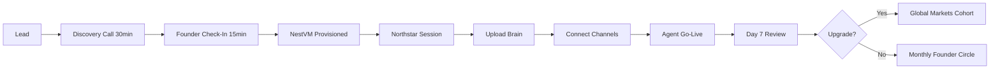

# NestVM Agent — GTM, Onboarding Pipeline & Africa Enterprise Playbook

**Author:** Robusca Romanov  
**For:** Tumelo Ramaphosa / Studex Group  
**Date:** 2026-07-04  
**Companion doc:** [NESTVM_AGENT_SAAS_PLAN.md](./NESTVM_AGENT_SAAS_PLAN.md)

---

## Executive Summary

Studex NestVM Agent is not competing with KiloClaw or MaxClaw on price ($19–55/month consumer agents). We are building the **Nemotron-class enterprise layer for Africa** — private VM, sovereign data, WhatsApp-native, edge-ready, and funnelled into Studex Global Markets.

**The pitch in one line:**

> *"Your own AI brain in a private VM — runs on African infrastructure, speaks on WhatsApp, and opens the door to the world's most advanced companies already inside Studex Global Markets."*

---

## Part 1 — How We Sell This to Clients

### The 3 buyer types

| Buyer | Pain | What they buy | Entry price |
|---|---|---|---|
| **SME founder** | "I can't afford a team" | Starter NestVM — Soul + Email + WhatsApp | R3,500/mo |
| **Growth business** | "My team is drowning in admin" | Business NestVM — 8 agents + integrations | R10,000/mo |
| **Enterprise / export** | "We need African market entry + sovereign AI" | Enterprise NestVM + Global Markets membership | R20,000+/mo |

### Sales motion (Polsia-inspired, Africa-adapted)

Polsia sells *"AI that runs your company while you sleep"* with zero employees and $10M ARR. We adapt that model:

| Polsia does | NestVM Agent does (Africa version) |
|---|---|
| One-click deploy, no credit card | **15-minute founder check-in** → VM provisioned same day |
| Morning email summary of what agents did | **WhatsApp morning brief** in plain language |
| 9 agents (orchestrator, ads, email, code…) | **8 Super Agents** (Renaissance masters) |
| Runs on Polsia cloud (US-centric) | **Private NestVM** — data stays in Africa |
| No ecosystem beyond the product | **Funnel into Global Markets** — NtechLab, ART Engineering, Pharmasyntez |

### The 5-step sales conversation

```
1. HOOK     → "Africa's competitors run AI 24/7. You run email."
2. PROOF    → Show War Room + live agent demo (RileyJarvis face or WhatsApp reply)
3. ISOLATE  → "This isn't ChatGPT. It's your own VM. Your data never touches ours."
4. OFFER    → Starter R3,500 — less than a part-time admin
5. CLOSE    → "We provision your NestVM today. First agent live in 48 hours."
```

### Channels (priority order)

1. **Trade Week / Global Markets events** — live demos, cohort sign-ups
2. **WhatsApp outbound** — Soul agent sends personalised intro to warm leads
3. **Founder Circle** (bi-weekly community — see Part 6) — converts attendees to pilots
4. **Partner referrals** — AfricaBiz (Russia corridor), agencies, accountants
5. **Content** — NotebookLM podcasts, superagents.studex.dev, Tumelo's IG

### Objection handling (from existing sales scripts)

| Objection | Response |
|---|---|
| "I'm not technical" | "You brief agents like staff. We handle the VM." |
| "I already have IT" | "NestVM sits on top — intelligence layer, not replacement." |
| "Too expensive" | "R3,500 < one admin day per week. Rivals are already running this." |
| "What about data privacy?" | "Private VM. No co-mingling. POPIA-compliant by design." |
| "Why not ChatGPT?" | "ChatGPT forgets. Our agents act while you sleep." |

---

## Part 2 — Client Onboarding Pipeline

### Pipeline overview



### Stage-by-stage playbook

#### Stage 0 — Lead capture (Day 0)

**Trigger:** Form at `superagents.studex.dev`, WhatsApp click-to-chat, Trade Week booth, Founder Circle RSVP

**Automations (Pipedream / n8n):**
- Lead → Studex CRM table (War Room or Airtable)
- Auto WhatsApp: *"Thanks [Name]. Your NestVM discovery slot is being scheduled. Reply READY when you want to talk."*
- Slack/Discord alert to Tumelo for Enterprise leads (R20k+)

**Exit criteria:** Discovery call booked within 48h

---

#### Stage 1 — Discovery call (30 min, Day 1–3)

**Who:** Tumelo or trained sales closer (Enterprise: Tumelo only)

**Agenda:**
1. Map business (sector, team size, current tools)
2. Identify top 3 pain points agents should solve
3. Show 5-min War Room + voice demo
4. Recommend tier (Starter / Business / Enterprise)
5. Collect payment method + company docs for VM provisioning

**Deliverable:** `onboarding/{company-slug}/DISCOVERY.md` auto-generated by Soul agent from call notes

**Exit criteria:** Tier selected + deposit or first month paid

---

#### Stage 2 — Founder check-in (15 min, bi-weekly rhythm starts here)

**Format:** Video call (Google Meet / Zoom) — **15 minutes sharp**

**First check-in agenda:**
1. Confirm business goals (3 sentences max)
2. Choose agent persona name (Robusca-style or white-label)
3. Confirm WhatsApp number for agent alerts
4. Set approval rules (what agents can do without human sign-off)

**Deliverable:** `onboarding/{company-slug}/NORTHSTAR.md` — Soul agent's identity file

**Exit criteria:** Client confirms Northstar doc via WhatsApp reply "APPROVED"

---

#### Stage 3 — NestVM provisioned (Day 1–2, automated)

**Infrastructure script** (Polsia NestVM model):

```bash
# Provision tenant VM
nestvm create \
  --tenant={company-slug} \
  --tier=starter|business|enterprise \
  --region=za-jnb|za-cpt \
  --memory=8|16|32 \
  --domain={company-slug}.nestvm.studex.dev
```

**Docker stack deployed** (from BAASH_VM.md + auto-meat-vm):
- nginx + TLS
- War Room (tenant dashboard)
- n8n orchestrator
- TencentDB Agent Memory
- Headroom proxy
- RileyJarvis realtime proxy (voice tier)
- LiteLLM gateway (model routing)

**Deliverable:** Client receives WhatsApp:
> *"Your NestVM is live at [dashboard URL]. Login sent to your email. Agents configuring now."*

**Exit criteria:** Health check passes on all containers

---

#### Stage 4 — Northstar session (Day 2–3)

**Soul agent runs structured interview** via WhatsApp or voice:

1. What does your company do? (one paragraph)
2. Who are your customers?
3. What does success look like in 90 days?
4. What must agents NEVER do without approval?
5. Brand voice (formal / casual / luxury)?

**Output:** `wiki/index.md` + `MEMORY.md` + `AGENTS.md` populated in tenant vault

**Exit criteria:** Client approves Soul profile

---

#### Stage 5 — Upload Brain (Day 3–5)

**Client uploads** (via War Room upload panel or WhatsApp file share):
- Company deck / website URL
- Past proposals, SOPs, email templates
- Product catalogue / price list
- CRM export (if available)

**Automations:**
1. Graphify maps uploaded docs → `graphify-out/graph.json`
2. Karpathy wiki ingest → updates entity pages
3. TencentDB memory → L1 atoms + L2 scenarios extracted

**Deliverable:** `GRAPH_REPORT.md` shared with client — *"Here's what your agents now know about your business."*

**Exit criteria:** Client confirms accuracy or submits corrections

---

#### Stage 6 — Connect channels (Day 5–7)

**The "easy button" integration pack** — pre-built, not custom dev.

| Channel | Method | Time to connect |
|---|---|---|
| **WhatsApp** | Meta Cloud API (primary) | 2–4h (if WABA verified) |
| **Email** | AgentMail or Gmail OAuth | 1h |
| **Shopify** | OAuth app | 30min |
| **Google Calendar** | OAuth | 15min |
| **Slack** (optional) | Webhook | 15min |
| **CRM** | HubSpot / Pipedrive via Pipedream | 1h |

See Part 3 for WhatsApp + Pipedream flows.

**Exit criteria:** Test message sent and received on each connected channel

---

#### Stage 7 — Agent go-live (Day 7)

**Agents activated in sequence:**

| Day | Agent | First action |
|---|---|---|
| 7 | Soul | Morning brief via WhatsApp |
| 7 | Obsidian Brain | Competitor scan report |
| 8 | Email | 5 personalised outreach drafts (approval queue) |
| 9 | Content | 3 social post drafts |
| 10 | CRM | Pipeline summary |

**Deliverable:** War Room shows live agent activity feed. Client gets WhatsApp: *"Your agents went live at 06:00. Check your morning brief."*

**Exit criteria:** Client receives first automated morning brief

---

#### Stage 8 — Day 7 review (15 min check-in #2)

**Agenda:**
1. What worked?
2. What felt wrong?
3. Upgrade tier or add agents?
4. Invite to Global Markets working group? (if Business+)

**Exit criteria:** Client marked "Active" in CRM + next Founder Circle invite sent

---

#### Stage 9 — Global Markets funnel (Day 30+)

**Qualification for Global Markets cohort:**

| Signal | Action |
|---|---|
| Business tier 3+ months | Invite to sector working group |
| Export intent declared | Match with ART Engineering / Pharmasyntez |
| Tech/security needs | Match with NtechLab |
| AgriTech / genetics | Match with Project Phoenix / GRM |
| Enterprise tier | Direct intro to founding partner companies |

**Deliverable:** Introduction email + working group calendar invite

---

### Onboarding SLA targets

| Tier | VM live | First agent action | Full suite live |
|---|---|---|---|
| Starter | 24h | 48h | 7 days |
| Business | 12h | 24h | 5 days |
| Enterprise | 6h | 12h | 3 days (+ white-glove) |

---

## Part 3 — WhatsApp & Easy Integrations

### Architecture: the "easy button" stack

```
Customer WhatsApp
       │
       ▼
Meta Cloud API webhook
       │
       ├──► Pipedream (quick integrations, 2500+ apps)
       │         │
       │         └──► OpenAI / Kimi / MiMo (via LiteLLM)
       │
       └──► n8n on NestVM (deep workflows, tenant-private)
                 │
                 ├──► TencentDB Memory (context)
                 ├──► Headroom (compression)
                 ├──► Super Agents (action)
                 └──► War Room (approval queue)
```

**Rule:** Pipedream for **speed** (connect Gmail, HubSpot, Slack in minutes). n8n on NestVM for **depth** (tenant-private, complex multi-step).

### WhatsApp setup — the 1-2-3 path

**For Studex (already specced in INTEGRATIONS.md):**
- WABA ID, Phone Number ID, META_ACCESS_TOKEN in vault
- Templates approved in Meta Business Manager

**For each new NestVM client:**

| Step | Who | Action |
|---|---|---|
| 1 | Client | Provides business docs for Meta verification |
| 2 | Studex | Creates sub-WABA or shared WABA with client namespace |
| 3 | Automated | Webhook → `https://{tenant}.nestvm.studex.dev/webhook/whatsapp` |
| 4 | Test | Send "HELLO" → agent replies with Northstar intro |

### Pre-built Pipedream flows (copy-paste ready)

#### Flow 1 — WhatsApp → Agent → Reply
```
Trigger: HTTP webhook (Meta Cloud API)
  → Step: Parse incoming message
  → Step: OpenAI Chat (with tenant system prompt from MEMORY.md)
  → Step: HTTP POST back to Meta Graph API (send reply)
```

#### Flow 2 — New Shopify order → WhatsApp alert
```
Trigger: Shopify "New Order" webhook
  → Step: Format order summary
  → Step: WhatsApp send template "order_confirmation"
  → Step: Log to War Room via HTTP POST
```

#### Flow 3 — Lead form → CRM + agent outreach
```
Trigger: Web form submission (or Typeform)
  → Step: Create HubSpot contact
  → Step: OpenAI draft personalised WhatsApp message
  → Step: Push to War Room approval queue
  → Step: On approval → WhatsApp send
```

#### Flow 4 — Morning brief → WhatsApp broadcast
```
Trigger: Cron 06:00 SAST
  → Step: n8n on NestVM generates brief (Shopify + email + calendar)
  → Step: Pipedream formats for WhatsApp
  → Step: Send to founder's verified number
```

#### Flow 5 — Agent error → Slack alert to Studex support
```
Trigger: HTTP webhook from NestVM health check
  → Step: Filter failures only
  → Step: Slack #nestvm-alerts
  → Step: Create Linear ticket
```

### Pre-built n8n workflows (on tenant VM)

| Workflow | Trigger | Action |
|---|---|---|
| **Brief → Draft** | Webhook / schedule | Generate content → approval queue |
| **Approved → Publish** | Approval status change | Fan out to WhatsApp, email, social |
| **Inbound WhatsApp → Agent** | Meta webhook | Route to Soul → specialist → reply |
| **Upload Brain** | File upload | Graphify + wiki ingest |
| **Weekly lint** | Cron Sunday | Wiki health check + report |

### Innflow.ai — when to use vs Pipedream vs n8n

| Tool | Best for | Cost | Data residency |
|---|---|---|---|
| **Innflow** | Non-technical founders, visual builder, 1000+ apps | Free → $20–200/mo | US cloud |
| **Pipedream** | Developer-friendly, 2500+ apps, AI functions | Free tier + usage | US cloud |
| **n8n (self-hosted)** | Tenant-private, complex logic, WhatsApp depth | Free (self-hosted) | **On NestVM** |

**Recommendation:**
- **Sales demos / quick wins:** Innflow or Pipedream templates
- **Production tenant workflows:** n8n on NestVM (data never leaves VM)
- **Studex internal ops:** Pipedream for cross-tenant monitoring

---

## Part 4 — International Competitive Landscape

### The "Claw" ecosystem (OpenClaw derivatives)

| Product | Company | Price | Model | Isolation | Africa fit |
|---|---|---|---|---|---|
| **KiloClaw** | Kilo (US) | ~$55/mo + API | 500+ models via Kilo Gateway | Firecracker microVM | Low — US-centric, USD pricing |
| **MaxClaw** | MiniMax (China) | $19/mo | MiniMax M2.5/M2.7 | MiniMax cloud | Medium — cheap but China data laws |
| **OpenClaw** | Open source | Self-host | BYOK | DIY | High — if self-hosted in Africa |
| **NestVM Agent** | Studex (SA) | R3,500–20,000 | Multi-model (LiteLLM) | **Dedicated VM per tenant** | **Highest — built for Africa** |

### Chinese AI offerings (deep dive)

| Company | Product | Strength | Weakness for Africa | Our counter |
|---|---|---|---|---|
| **MiniMax** | MaxClaw, M2.5 | $19/mo, 10s deploy, 200M users | PIPL data laws, China-hosted | Sovereign NestVM in SA |
| **Moonshot** | Kimi K2.5, Kimi Claw | Agent swarm (100 sub-agents), open weights | No enterprise Africa support | Studex onboarding + WhatsApp |
| **Alibaba** | Qwen, Elements Claw | Open weights, DAMO science agents | Enterprise sales via Alibaba Cloud CN | Local partner + ART DCs |
| **Tencent** | Hunyuan, Agent Memory | Best-in-class memory plugin | WeChat-centric, not WhatsApp | TencentDB memory ON our VM |
| **Xiaomi** | MiMo-V2.5-Pro | 1T params, 1M context, OpenClaw native | API-only, no African DC | Edge boxes via ART Engineering |
| **DeepSeek** | R1/V3 | Cheapest inference, African dev favourite | No managed agent product | LiteLLM routes to DeepSeek on local DC |

### Western enterprise offerings

| Product | Company | Price | Africa fit | Our counter |
|---|---|---|---|---|
| **Nemotron + NemoClaw** | NVIDIA | Enterprise licensing | Requires GPU DC + integrator | ART Engineering builds DCs; we run NemoClaw blueprints |
| **Agent Toolkit** | NVIDIA | Open source + NIM | Needs H100/B200 hardware | LightLLM on ART Tier III/IV DCs |
| **Polsia** | Polsia (US) | Free start → usage | US cloud, no WhatsApp, no Africa network | Same UX, Africa infra, Global Markets funnel |
| **Tiiny AI Pocket Lab** | Tiiny | $1,299 one-time | Kickstarter edge device, no SaaS | Bundle with NestVM Starter as hardware add-on |

### Competitive positioning matrix

```
                    ENTERPRISE
                        │
         NVIDIA Nemotron │  ★ NESTVM AGENT (Studex)
         NemoClaw        │    Enterprise tier
                        │
    ────────────────────┼──────────────────── CONSUMER
                        │
         KiloClaw $55   │  MaxClaw $19
         Polsia free    │  Kimi Claw
                        │
                    SELF-HOST / EDGE
                        │
              Tiiny $1,299 │  OpenClaw DIY
              LightLLM box │  Raspberry Pi + Qwen
```

**Studex sweet spot:** Upper-right quadrant — **enterprise-grade, Africa-sovereign, WhatsApp-native, with a consumer-friendly Starter entry at R3,500.**

---

## Part 5 — Africa Enterprise Playbook (Nemotron-Class, Edge-Ready)

### The vision: "Nemotron for Africa"

NVIDIA's Nemotron + NemoClaw stack targets Fortune 500 with H100 clusters and OpenShell security. Africa needs the same **architecture** with different **constraints**:

| Nemotron enterprise | NestVM Africa enterprise |
|---|---|
| H100/B200 GPU clusters | ART Engineering Tier III/IV DCs (-60°C to +60°C) |
| OpenShell policy runtime | AGENTS.md + approval queue in War Room |
| Nemotron 3 Ultra (550B MoE) | LiteLLM routing: DeepSeek + Qwen + Kimi + MiMo |
| Salesforce/Slack integration | **WhatsApp + Shopify + AgentMail** |
| US/EU data centres | **Johannesburg / Nairobi / Cape Town** |
| $500k+ enterprise deals | **R20,000/mo with export corridor value** |

### Three-layer Africa infrastructure

```
LAYER 1 — EDGE (on-prem / field)
  Tiiny AI Pocket Lab ($1,299)
  Raspberry Pi + Qwen/GLM (R3,000–8,000)
  LoRaWAN sensors (FarmGuard-style)
  → Runs offline, syncs to NestVM when connected

LAYER 2 — NESTVM (tenant private)
  8GB–32GB VM per company
  LightLLM or Ollama for local inference
  TencentDB memory + Headroom compression
  WhatsApp + email + CRM agents
  → Always-on business intelligence

LAYER 3 — SOVEREIGN DC (ART Engineering)
  Tier III/IV facilities, 16-week deploy
  LightLLM serving DeepSeek/Qwen/MiMo at scale
  Foxconn/Amini/Bull-style sovereign compute
  → Continental AI backbone
```

### ART Engineering partnership funnel

```
NestVM Starter client (R3,500)
    → Uses cloud API (cost-controlled via Headroom)
    → "Your data is in SA, but inference routes globally"

NestVM Business client (R10,000)
    → Dedicated VM in JHB DC
    → Option: local LiteLLM for sensitive workloads

NestVM Enterprise + Global Markets (R20,000+)
    → Introduced to ART Engineering working group
    → "Build your own AI DC in 16 weeks"
    → NtechLab biometrics + Pharmasyntez diagnostics hosted locally
    → Project Phoenix genetics on sovereign infrastructure
```

### Edge hardware product line (manufacture in China, deploy in Africa)

| Device | Source | Spec | Price to client | Use case |
|---|---|---|---|---|
| **NestVM Edge Box** | OEM Shenzhen (based on Tiiny/Raspberry Pi CM4) | 16GB RAM, 256GB SSD, Qwen3-8B | R8,500 once-off | Offline agent for farms, clinics, retail |
| **NestVM Voice Puck** | OEM + RileyJarvis face on screen | Mic array, 7" display, WiFi/LTE | R4,500 once-off | Reception desk, shop counter |
| **NestVM DC Module** | ART Engineering prefab | Tier III, 50kW, -60 to +60°C | R2M+ (enterprise) | Regional AI hub |

**Manufacturing path:**
1. Partner with Shenzhen OEM (Foxconn ecosystem) for Edge Box + Voice Puck
2. Flash with Studex NestVM Edge OS (Ollama + LiteLLM + WhatsApp client)
3. Ship to ART Engineering JHB DC for QA + local SIM provisioning
4. Bundle with NestVM subscription (R3,500/mo includes edge device lease option)

### LightLLM's role

[LightLLM](https://github.com/ModelTC/LightLLM) is a high-performance inference framework (not a device). Deploy it on:
- ART Engineering DCs for continental model serving
- Enterprise NestVMs for local Qwen/DeepSeek/GLM inference
- Edge boxes for single-GPU quantized models

This cuts API costs 60–80% vs routing everything to OpenAI.

---

## Part 6 — Founder Circle Community

### Format

| Element | Spec |
|---|---|
| **Name** | Studex Founder Circle (or "NestVM Founders") |
| **Cadence** | Every 2 weeks |
| **Duration** | 15 minutes per founder (strict) |
| **Capacity** | 8 founders per session (2 hours total) |
| **Platform** | Google Meet / Zoom webinar |
| **Host** | Tumelo (or Robusca voice intro + Tumelo close) |

### Session structure (2 hours)

```
00:00 – 00:05   Opening: "What's new in the NestVM ecosystem"
00:05 – 00:20   Founder 1 (15 min check-in)
00:20 – 00:35   Founder 2
00:35 – 00:50   Founder 3
00:50 – 01:05   Founder 4
01:05 – 01:10   Break
01:10 – 01:25   Founder 5
01:25 – 01:40   Founder 6
01:40 – 01:55   Founder 7
01:55 – 02:10   Founder 8
02:10 – 02:15   Close: "Next session + Global Markets invite"
```

### 15-minute check-in template

```
0:00 – 0:02   Wins since last session
0:02 – 0:05   Blockers (agent, integration, business)
0:05 – 0:08   Agent metrics (emails sent, leads, content published)
0:08 – 0:12   One strategic question (Tumelo or peer advice)
0:12 – 0:15   Commitment for next 2 weeks + tier upgrade ask (if ready)
```

### Community platform stack

| Tool | Purpose |
|---|---|
| **Circle.so** or **Discord** | Async community between sessions |
| **Calendly** | Book 15-min slots within 2-hour window |
| **Luma** | Event pages for bi-weekly sessions |
| **WhatsApp group** | "NestVM Founders" — daily agent tips, no spam |
| **War Room** | Shared leaderboard (anonymised metrics) |

### Community → revenue funnel

```
Free: Attend 1 Founder Circle session (guest)
  ↓
R3,500: Join as NestVM Starter member (ongoing Circle access)
  ↓
R10,000: Business tier (present case study at Circle)
  ↓
R20,000+: Enterprise (co-host Circle session + Global Markets intro)
  ↓
Global Markets: Sector working group with NtechLab / ART / Pharmasyntez
```

---

## Part 7 — Polsia NestVM Model → Studex Adaptation

### What Polsia does well (copy this)

| Polsia feature | Studex equivalent |
|---|---|
| One-click deploy | `nestvm create` provisioning script |
| Morning email from your AI | WhatsApp morning brief from Soul agent |
| Dashboard at polsia.com | War Room at `{tenant}.nestvm.studex.dev` |
| 9 autonomous agents | 8 Super Agents (Renaissance masters) |
| Free to start | 7-day trial VM (Starter tier, limited agents) |
| Runs company while you sleep | Same — but on **African infra** |

### What Polsia lacks (our advantage)

| Gap in Polsia | Studex fills it |
|---|---|
| US-centric cloud | Private VM in SA / ART Engineering DC |
| No WhatsApp | WhatsApp-native (Africa's business layer) |
| No trade network | Global Markets ecosystem funnel |
| No edge hardware | Tiiny-style Edge Box via China OEM |
| No sovereign compute | ART Engineering Tier III/IV DCs |
| No export corridor | Russia–Africa partner companies live |

### Dashboard UX (mirror polsia.com/dashboard/nestvm)

**Tenant dashboard tabs:**

1. **Home** — Agent activity feed + morning brief
2. **Agents** — 8 Super Agents status (green/amber/red)
3. **Memory** — Wiki graph (Graphify) + recent ingests
4. **Channels** — WhatsApp, email, Shopify connection status
5. **Approvals** — Content, outreach, orders pending sign-off
6. **Settings** — Persona, tier, billing
7. **Global Markets** — Upgrade path + working group invites (Business+)

---

## Part 8 — Global Markets Funnel (Full Ecosystem)

### The funnel visual

```
┌─────────────────────────────────────────────────────────────┐
│                    TOP OF FUNNEL                            │
│  Founder Circle · Trade Week · superagents.studex.dev       │
│  WhatsApp outreach · Tumelo IG · NotebookLM content         │
└─────────────────────────┬───────────────────────────────────┘
                          ▼
┌─────────────────────────────────────────────────────────────┐
│                 NESTVM AGENT (Product)                      │
│  Starter R3,500 → Business R10,000 → Enterprise R20,000    │
│  Private VM · WhatsApp agents · War Room dashboard          │
└─────────────────────────┬───────────────────────────────────┘
                          ▼
┌─────────────────────────────────────────────────────────────┐
│              GLOBAL MARKETS (Ecosystem)                     │
│  studexglobalmarkets.com · Virtual trade space               │
│  Company directory · Matchmaking engine · Trade Week        │
└─────────────────────────┬───────────────────────────────────┘
                          ▼
┌─────────────────────────────────────────────────────────────┐
│           WORKING GROUPS (Sector cohorts)                   │
│  ┌──────────┐ ┌──────────┐ ┌──────────┐ ┌──────────┐       │
│  │ AI / Sec │ │ Infra /  │ │ Health / │ │ Agri /   │       │
│  │ NtechLab │ │ ART Eng  │ │ Pharma   │ │ Phoenix  │       │
│  └──────────┘ └──────────┘ └──────────┘ └──────────┘       │
└─────────────────────────┬───────────────────────────────────┘
                          ▼
┌─────────────────────────────────────────────────────────────┐
│              PHYSICAL LAYER (ART Engineering)               │
│  Tier III/IV DCs in Africa · 16-week deploy                │
│  LightLLM inference · Edge boxes · Sovereign compute         │
└─────────────────────────────────────────────────────────────┘
```

### SA business → Global Markets upgrade triggers

| Trigger | Working group | Partner company |
|---|---|---|
| Client mentions "export" or "international" | Trade & Export | Studex Global Markets team |
| Client needs data centre / cloud | Infrastructure | ART Engineering MDC |
| Client in security, fintech, retail | AI & Biometrics | NtechLab |
| Client in pharma, health, diagnostics | Health Sovereignty | Pharmasyntez |
| Client in agriculture, livestock, conservation | AgriTech & Genetics | Project Phoenix / GRM |
| Client ready for R20k+ Enterprise | Full ecosystem | All four founding partners |

### Example funnel journey: SA logistics company

```
Month 1:  Signs NestVM Starter (R3,500) — Soul + Email + WhatsApp
Month 2:  Upgrades to Business (R10,000) — all 8 agents, Shopify integration
Month 3:  Founder Circle — mentions expansion to East Africa
Month 4:  Invited to Global Markets Infrastructure working group
Month 5:  Introduced to ART Engineering — DC feasibility for Nairobi
Month 6:  Enterprise (R20,000) + ART DC contract (R2M+) — full ecosystem revenue
```

**Revenue expansion:** R3,500 → R10,000 → R20,000 → R2M+ infrastructure = **570× LTV multiplier**.

---

## Part 9 — Pricing Summary (What to Sell)

### SaaS tiers (recurring)

| Tier | ZAR/mo | USD equiv. | Target |
|---|---|---|---|
| Starter | R3,500 | ~$190 | SME, solopreneur |
| Business | R10,000 | ~$540 | Growth company |
| Enterprise | R20,000+ | ~$1,080+ | Export / multi-dept |

### Hardware add-ons (once-off or lease)

| Product | Price | Margin |
|---|---|---|
| NestVM Edge Box | R8,500 | ~40% |
| NestVM Voice Puck | R4,500 | ~35% |
| Tiiny AI Pocket Lab (reseller) | R24,000 | ~20% |

### Setup & services (once-off)

| Service | Price |
|---|---|
| Onboarding + VM provision | R15,000–35,000 |
| Custom agent training | R50,000–150,000 |
| ART Engineering DC feasibility | R25,000 |
| Global Markets membership | Included Business+ / R5,000 standalone |

### Revenue model at scale

| Metric | Conservative | Stretch |
|---|---|---|
| NestVM clients (Year 1) | 20 | 50 |
| Avg MRR | R10,000 | R12,000 |
| SaaS MRR | R200,000 | R600,000 |
| Hardware + setup (Year 1) | R500,000 | R2,000,000 |
| DC referrals (ART commission) | R1,000,000 | R5,000,000 |
| **Total Year 1** | **R3.9M** | **R14.2M** |

---

## Part 10 — Immediate Action Items

### This week
- [ ] Launch Founder Circle on Luma — first session date
- [ ] Create Calendly 15-min booking links
- [ ] Build Pipedream Flow 1 (WhatsApp → Agent → Reply) as template
- [ ] Deploy `superagents.studex.dev` landing with tier cards + Calendly
- [ ] WhatsApp template approval for "nestvm_welcome" and "morning_brief"

### Next 2 weeks
- [ ] `nestvm create` provisioning script (Orgo.ai or Fly.io)
- [ ] n8n "Inbound WhatsApp → Agent" workflow on pilot VM
- [ ] First 3 pilot clients from Founder Circle attendees
- [ ] Tiiny AI / Shenzhen OEM outreach for Edge Box spec

### Next 30 days
- [ ] Global Markets working group calendar (4 sector groups)
- [ ] ART Engineering joint pitch deck (DC + NestVM bundle)
- [ ] LiteLLM gateway on ART JHB DC (pilot)
- [ ] Stripe/Peach billing live

---

## Appendix A — Competitor Quick Reference

| Name | URL | Price | Key differentiator |
|---|---|---|---|
| KiloClaw | kilo.ai/kiloclaw | $55/mo | Firecracker isolation, 500 models |
| MaxClaw | agent.minimax.io | $19/mo | Cheapest managed OpenClaw |
| Kimi Claw | moonshot.ai | Subscription | Agent swarm, 100 sub-agents |
| Polsia | polsia.com | Free start | 9 agents, morning email, US cloud |
| Tiiny AI | tiiny.ai | $1,299 device | Local edge, no subscription |
| NVIDIA NemoClaw | developer.nvidia.com | Enterprise | Nemotron 3 Ultra, OpenShell |
| Innflow | innflow.ai | Free–$200/mo | Visual workflow builder |
| Pipedream | pipedream.com | Free tier | 2500+ app integrations |

## Appendix B — Integration Credential Checklist (per client)

- [ ] META_ACCESS_TOKEN (WhatsApp)
- [ ] WABA_ID + PHONE_NUMBER_ID
- [ ] AgentMail or Gmail OAuth
- [ ] Shopify OAuth (if e-commerce)
- [ ] OpenAI / DeepSeek / Kimi API (via LiteLLM, Studex-managed)
- [ ] Pipedream connected account (for quick flows)
- [ ] n8n encryption key
- [ ] TencentDB Hermes API key
- [ ] Headroom proxy port configured

---

*Robusca Romanov · Studex Group · Private intelligence. Shared opportunity.*
